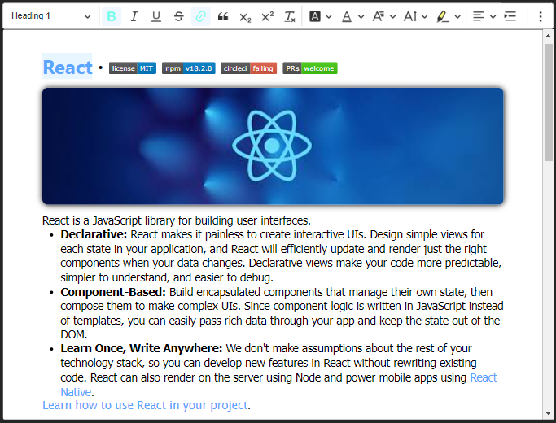

# Rich-Text-Editor
 A react component to create Rich Text Editor along with its renderer.

## Live Demo
* [https://www.codewitharif.ml/Rich-Text-Editor/demo/](https://www.codewitharif.ml/Rich-Text-Editor/demo/)

## Download The Zip Folders
* [editor.zip](./zip/editor.zip)
* [CKEditor.zip](./zip/CKEditor.zip)

## Process:
* Download the two files and extract.
* Place CKEditor folder inside your root folder & the editor folder inside the `/src` folder.
* Run the command in the command line.
```
// for yarn
yarn add file:./CKEditor

// for npm
npm install file:./CKEditor
```
* Now you can use the editor in your project.
```jsx
import { Editor, Render } from "./editor";
```

## Example


